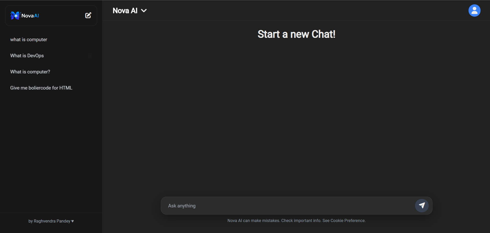
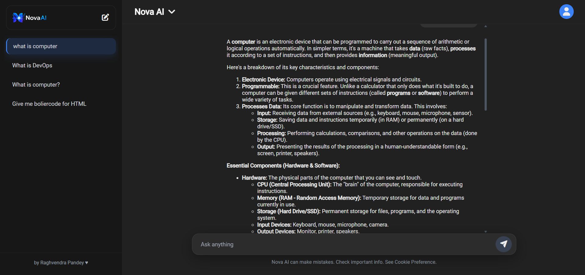
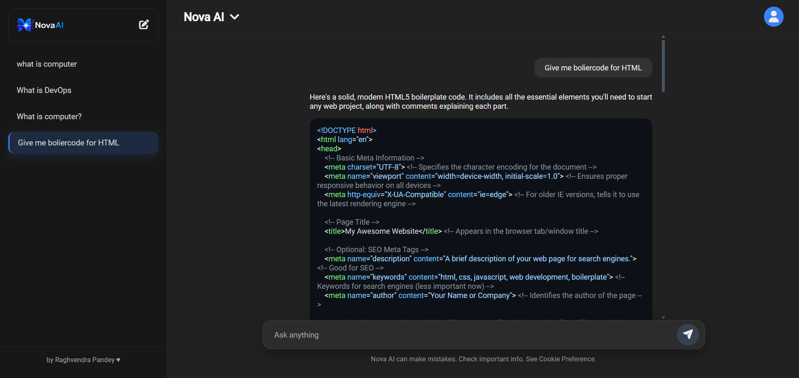

# 🚀 NovaAI – Full-Stack AI Assistant

<p align="center">
  
</p>

<h3 align="center">
A Modern AI-Powered Conversational Assistant built with React, Node.js, Express & Google Gemini AI
</h3>

<table align="center">
<tr>
<td align="center">

<a href="https://nova-ai-wheat-one.vercel.app/">


</a>

</td>

<td align="center">

<a href="https://github.com/raghvendra-official/NovaAI">


</a>

</td>
</tr>
</table>

<p align="center">


</p>

---

---

# 📖 Overview

NovaAI is a modern AI-powered conversational assistant inspired by ChatGPT and Google Gemini. It features an elegant chat interface, persistent conversation history, Markdown rendering, syntax-highlighted code blocks, typing animations, and seamless integration with Google's Gemini AI model.

The application follows a full-stack architecture with a React frontend and a Node.js + Express backend, providing a clean separation between the user interface and AI services.

---

# 🌐 Live Demo

🚀 **Launch NovaAI**

https://nova-ai-wheat-one.vercel.app/

---

# ✨ Features

- 🤖 AI-powered conversations using Google Gemini
- 💬 Persistent conversation history
- ⚡ Fast AI response generation
- ✍️ Typing animation while AI responds
- 📝 Markdown rendering
- 🎨 Syntax-highlighted code blocks
- 📋 Copy-friendly formatted responses
- 🌙 Modern dark UI
- 📱 Responsive design
- 🔄 Multi-conversation support
- 🚀 Built with Vite for blazing-fast performance

---

# 🖼️ Screenshots

## Home Screen



---

## Chat Interface



---

## AI Code Generation



---

## 🏗️ Project Structure

```text
NovaAI
│
├── Frontend
│   ├── public
│   ├── src
│   │   ├── assets
│   │   ├── styles
│   │   ├── App.jsx
│   │   ├── Sidebar.jsx
│   │   ├── Chat.jsx
│   │   ├── ChatWindow.jsx
│   │   └── MyContext.jsx
│   │
│   ├── package.json
│   └── vite.config.js
│
├── Backend
│   ├── controllers
│   ├── routes
│   ├── server.js
│   ├── package.json
│   └── .env
│
├── assets
│   └── logo.png
│
├── screenshots
│   ├── home.png
│   ├── chat.png
│   └── code.png
│
└── README.md
```

---

# ⚙️ Tech Stack

| Category | Technologies |
|----------|--------------|
| Frontend | React, Vite, CSS3 |
| Backend | Node.js, Express.js |
| AI | Google Gemini API |
| Libraries | React Markdown, Highlight.js, React Spinners |
| Tools | Git, GitHub, REST API |

---

# 🚀 Getting Started

## Clone the Repository

```bash
git clone https://github.com/raghvendra-official/NovaAI
```

```bash
cd YOUR_REPOSITORY_NAME
```

---

## Install Dependencies

### Backend

```bash
cd Backend
npm install
```

### Frontend

```bash
cd ../Frontend
npm install
```

---

# 🔑 Environment Variables

Create a `.env` file inside the **Backend** directory.

```env
GEMINI_API_KEY=YOUR_API_KEY
PORT=8080
```

---

# ▶️ Run the Project

### Start Backend

```bash
cd Backend
npm run dev
```

### Start Frontend

```bash
cd Frontend
npm run dev
```

Open:

```
http://localhost:5173
```

---

# 🌍 Deployment

| Service | Platform |
|----------|----------|
| Frontend | Vercel |
| Backend | Node.js + Express |
| AI Model | Google Gemini API |

---

# 📈 Performance Highlights

- ⚡ Optimized React rendering
- 📦 Modular architecture
- 🎯 Responsive layout
- 🧩 Clean component structure
- 🔥 Fast development using Vite

---

# 🚀 Future Enhancements

- 🎤 Voice Assistant
- 📎 File Upload Support
- 🖼️ Image Generation
- 📄 Export Conversations
- 🔐 User Authentication
- ☁️ Cloud Database
- 🔍 Chat Search
- 🌙 Light/Dark Theme Toggle
- ⚡ Streaming AI Responses
- 🐳 Docker Support

---

# 🔗 Project Links

| Resource | Link |
|----------|------|
| 🌐 Live Demo | https://nova-ai-wheat-one.vercel.app/ |
| 💻 GitHub Repository | https://github.com/raghvendra-official/NovaAI |
| 👨‍💻 LinkedIn | https://www.linkedin.com/in/raghvendraofficial/ |

---

# 📄 License

This project is licensed under the **MIT License**.

---

# 👨‍💻 Author

**Raghvendra Pandey**

💼 LinkedIn  
https://www.linkedin.com/in/raghvendraofficial/

💻 GitHub  
https://github.com/raghvendrapandey

---

<p align="center">

⭐ If you like this project, consider giving it a star on GitHub!

</p>